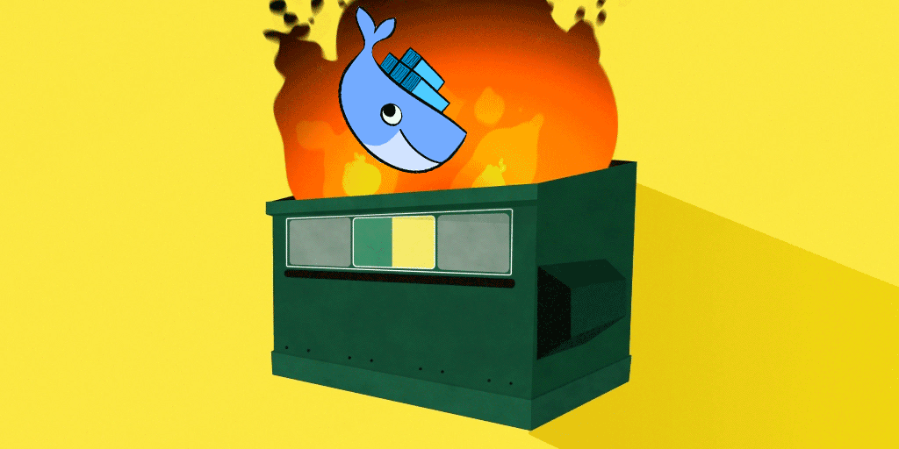
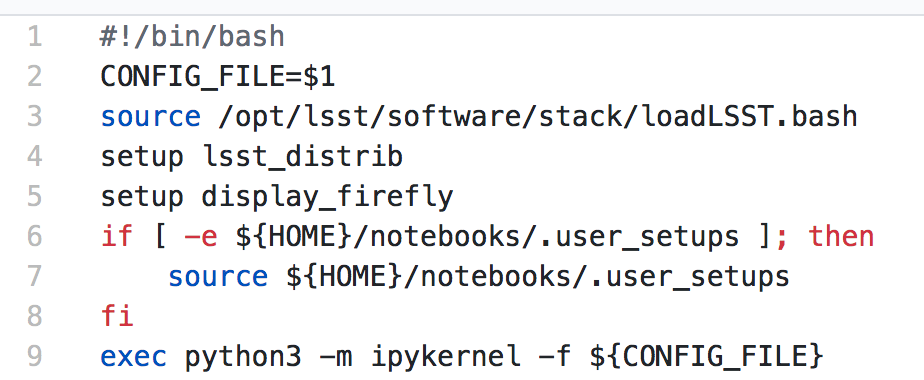
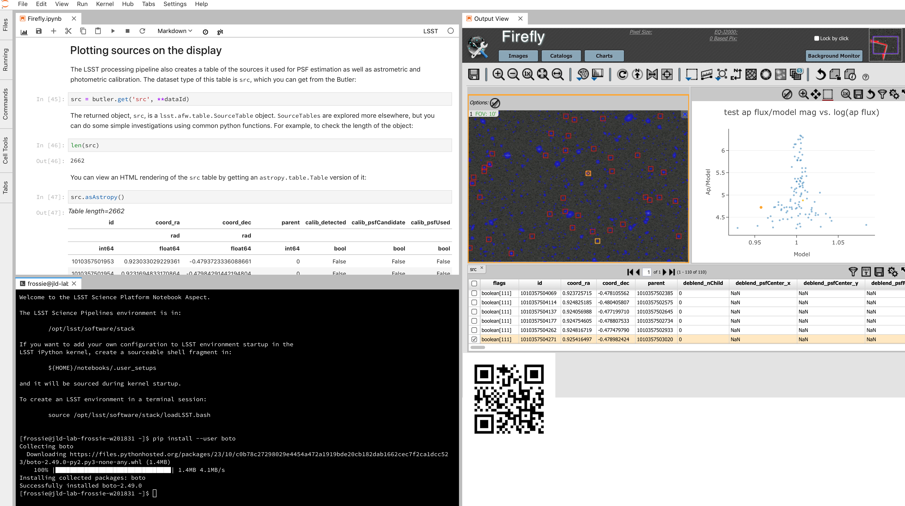

.. :css: css/talk.css

.. That's the light-background version.

:css: css/talk_dark.css

..  Swap that in if you want the dark-background version

:title: If The Data Will Not Come To The Astronomer...
:author: Adam Thornton

.. role:: raw-role(raw)
    :format: html

If The Data Will Not Come To The Astronomer...
##############################################

Adam Thornton
=============

LSST
====

athornton@lsst.org

----

:data-x: r4800

This Talk
#########

* https://athornton.github.io/JupyterCon-2018-talk
* http://ls.st/ujf

Licensed under Creative Commons Attribution 4.0 International license
(`CC BY 4.0`)

.. _CC BY 4.0: https://creativecommons.org/licenses/by/4.0/legalcode

----

Overview
########

Large Synoptic Survey Telescope
===============================

Astronomical Analysis Methodologies
===================================

Interactive Notebook Environment
================================

|

----

LSST
####

The Large Synoptic Survey Telescope
===================================

LSST is funded by the National Science Foundation and the Department of
Energy, as well as a host of other generous donors, public and private.

----

LSST Science Goals
##################

* LSST will perform a ten-year survey of the Southern sky: whole sky
  every three nights at optical and infrared wavelengths.

* Primary goal: detection of faint objects that change between visits:

  * Comprehensive solar system survey.

    * NEOs (> 90% 140m objects by 2040).

    * Trans-Neptunian Objects (TNOs).

  * Milky Way structure and stellar content.

  * Transient phenomena at optical wavelengths.

    * AGNs, SN1ae, neutron star/black hole mergers ...

  * Dark Energy and Dark Matter.

    * Only 4 percent of the mass and energy in the universe is baryonic.

    * Is the Hubble Constant the same in every direction?

.. note::

    Just say "objects at every astronomical scale" and list the four.
    Don't describe them.

----

Data Collection Scale
#####################

* About 20 TB a night (roughly entire HST lifetime each week)
* Half an exabyte in the final image collection (DR11).
* Over one trillion photometric measures of celestial sources.
* Reduced catalogue (which most people will use):

  * Smaller than image collection: order of 15 PB.
  * Tens of billions of (complex-structured) rows in a database.

----

Data Scale
##########

* The data is too big to move easily.

* Hence the need for a standardized compute deployment environment that
  facilitates rapid iteration through hypotheses that consider arbitrary
  subsets of the data.

* This is at odds with the historical method of astronomical analysis.

* We have an answer for this, but first...what is that data?

----

Observations of Celestial Objects
#################################
* 10-40 million AGNs (quasars).
* 300,000 supernovae a year.

  * Current detection rate is about 7,000 supernovae per year.
    
  * A supernova explodes in a Milky-Way-scale galaxy once every few
    hundred years.
    
  * One goes off somewhere in the observable universe roughly every ten
    seconds.
    
* Roughly 20 billion galaxies.
* Roughly 20 billion stars.

  * So everyone could have about three of each.

----

LSST Resources
##############

* `Andy Connolly's LSST TED Talk`_.

* `LSST Key Numbers`_.

* `LSST Overview Paper`_.

.. _Andy Connolly's LSST TED Talk: https://www.ted.com/talks/andrew_connolly_what_s_the_next_window_into_our_universe

.. _LSST Key Numbers: https://confluence.lsstcorp.org/display/LKB/LSST+Key+Numbers

.. _LSST Overview Paper: https://arxiv.org/abs/0805.2366

----

Depth
#####

Deepest ground-based survey telescope
=====================================

* Naked eye: 6 magnitude.
* Single-visit (red): 24.7 magnitude.
* 10-year stacked depth (red): 27.5 magnitude.
* 30/400 million times fainter than naked eye.

However...

* Not the deepest *telescope*.
* Hubble Space Telescope: 31.
* James Webb Space Telescope: 34 magnitude (expected)

----

Field of view
#############

Depth isn't everything.

* Humongous FoV: 9.62 degrees :raw-role:`2`.

* 40 full moons; roughly a CD held at arm's length.

* JWST, by contrast, is 9.7 arcmin :raw-role:`2`, so roughly
  1/3600 of LSST.

* This lets us cover the whole Southern sky in three nights.

.. image:: images/fov.png
  :height: 400px
  :align: center

----

Camera
======

* Focal plane array: 3.2 Gpixels.

  * Nadine Kurita, former Project Manager for Camera, for scale.

* 189 4K x 4K sensors (roughly 400 4K monitors).
* 18 bits per pixel.
* Each exposure 15 seconds.
* Two exposures per visit (to do cosmic-ray/atmospheric transient
  rejection, plus a bit of science).

.. image:: images/camera.png
  :height: 400px
  :align: center
  
----

`LSST Mirror Design`_
=====================

* 8.4m, but that combines primary and tertiary.
    * Effective collection area equivalent to 5.6m mirror.
* Not the largest primary telescope mirror, but...
* The primary/tertiary mirror is the largest monolithic piece of glass
  ever fabricated.

.. _LSST Mirror Design: https://www.lsst.org/about/tel-site/mirror

.. image:: images/mirror.gif
  :height: 400px
  :align: center

.. note::

    Larger mirrors are generally segmented rather than monolithic.

----

Cost
####

* Observatory: about $500 million (all numbers in 2013 dollars).

* Camera: about $165 million.

* Primary/tertiary mirror: about $25 million.

* Operations:

  * A little more than a dollar a second.

  * On the order of $100,000 a day.

  * Roughly $35 million a year.

----

Site
####

:raw-role:`<iframe width="1165" height="655" src="https://www.youtube.com/embed/bhuadLB7jvc" frameborder="0" allow="autoplay; encrypted-media" allowfullscreen></iframe>`

----

|

----

Astronomical Status Quo
#######################

Historically, astronomical research has been done with:

* Desktop or laptop computer:
    * Usually pretty beefy by the standards of the day.
* Astronomical software:
    * Usually written by the researcher to address a particular
      hypothesis.
    * Usually written by a single astronomer, rather than a
      team of software engineers.
    * Maybe written by many astronomers, which is arguably worse.
* Downloaded data stored locally.

----

Obvious Failure Modes
#####################

* Local machine: age, security, IT practices.

* Software: applicability, software engineering.

* Data: scale, backups, DR.

----

Data
####

* Rights: already extremely broad.

    * Roughly half the astronomical community.
    * Finding reviewers for the overview paper has been hard.

* Scale: most will never be directly examined by a human.

----

A Different Way To Do Astronomy
###############################

* The analysis, not the data, is the professionally-valuable part.
* How do we facilitate rapid iteration of analysis?

  * Quickly try a lot of hypotheses and discard unpromising ones.
  * Once you have one you like, turn it loose on a lot of data.

----

Interactive vs. Batch
#####################

We expect that a researcher will use the "interactive notebook aspect of
the LSST Science Platform" (by which we mean JupyterLab, or perhaps its
successors) to perform this iteration.  It is a rapid prototyping tool
with the following characteristics:

* Relatively tiny subset of the data: a few terabytes, probably less.
* The *real* analysis will be submitted to a batch system to work on
  petabyte-scale data.
* We don't (and can't) know what subset we want in advance.

----

What does this imply?
#####################

* It's not really about speed of data access or computation.
* Access to completely arbitrary subsets of the data, however, is
  *absolutely crucial*.
* Bring your code to the data, not the other way around.

----

What Do We Want?
################

Let's imagine a better world:

* You don't need to spend hours-to-weeks setting up the software
  environment.
* In fact, all that's needed for analysis is a web browser.  Compute and
  data storage happen somewhere else.
* You have a single login to manage your access to the environment.
* You don't need to pick a data subset that will fit on your laptop or
  your desktop NAS.
* The analysis is running on professionally-maintained machines in a
  real datacenter somewhere that it isn't your problem.

----

Community Acceptance
####################

The trickiest design goal is that we cannot make any user's life
significantly worse than the status quo.

Obviously the current system isn't ideal:

* Large, complex, bespoke analysis stack.

* Hugely complicated installation and configuration.

* Enormous amounts of technical debt.

But...it also gets the job done.  The analysis software encodes
literally hundreds, perhaps thousands, of astronomer-years of work on
difficult problems.  It is inherently complex.

We have to please several different groups of users.

----

User Community
##############

Analysis Pipeline Consumers
===========================

We have this one covered.  If you want to use the existing toolset to
analyze collected data, and you're not coming to the project with a lot
of prior experience or actively developing the pipeline software, we're
delivering a far superior way to get your work done than the prior art.

----

User Community
##############

Analysis Pipeline Developers
============================

The LSST stack is big.  No one works on the whole thing.  The way it's
developed is that someone takes a version (either a release version,
approximately every 6 months, or a weekly build) and works on their own
little corner of it in a conda or pip environment.  We must support
that.

----

User Community
##############

Established Astronomers
=======================

The people who have tenure and bring in the grants already have a
workflow that works well for them.  Sure, it's based on FORTRAN IV and
FITS files, but they've gotten really, really good at it.

In practice: you need a Terminal window that gives you shell access to
something that looks like a Unix system.  We mimic a system on which you
have an unprivileged account, which is very familiar to academic users.

There is something of an Uncanny Valley problem here.

----

User Community
##############

Security; generally, Operational Support
========================================

It's a fair cop, but if if we make it look like an existing multi-user
system, where the user doesn't have ``root`` or ``sudo`` within the
container, and has write access only to ``${HOME}`` and scratch space
but not the OS, and furthermore we show that we can completely
characterize the container's contents, it's a much easier sell.

----

The Big Reveal
##############

(Not actually a surprise to anyone at this conference.)

Kubernetes + JupyterHub + JupyterLab
====================================

* Kubernetes: it clearly won.  Google, Amazon, and Azure all offer
  managed Kubernetes infrastructure.
* JupyterLab: the UX is much better than the classic notebook.
  Multiple panes within a single browser tab, including terminal
  sessions, is a tremendous feature, giving users basically an IDE.
* JupyterHub: the obvious choice for access control and resource
  allocation brokering.  Authenticator and Spawner subclasses let us
  do some really nifty things, which you will see.

----

Abstraction and Layering
########################

* Virtualization lets you stop caring about the specifics of your
  hardware.
* Containerization lets you stop caring about managing the
  OS/distribution layer.
* Kubernetes lets you stop caring about managing the inter-component
  networking of your application and container lifecycle management.

----

The Long Bet
############

Kubernetes will save astronomy.

* It's the first time we've had a functional abstraction layer that
  allows you to specify scalable architectural designs.
* This lets you create complex multicomponent applications that will run
  on any suitable cluster, with built-in lifecycle management.
* And because it's modular, you can use best-practice patterns for all
  the infrastructure and only *really* care about managing the analysis
  stack that is your actual application.

----

Modularity
##########

* Separate plumbing from application.
* Provide a clear way to replace the value-added part (for us: the LSST
  Science Pipeline) with your own payload.
* Retain the robust infrastructure with component lifecycle management
  and automated resource allocation.

This lets you both have your cake and eat it.  You get to use whatever
insanely complex analysis framework you want wrapped inside a
general-purpose, self-healing application architecture.

----

Presenting the Analysis Component
#################################

Replacing the payload is a matter of replacing the JupyterLab container
that is spawned for the user.  All you need is:

* A container that will start a JupyterLab server.
* `Some way`_ to wrap your analysis pipeline up as a Jupyter kernel.

I would be flabbergasted if this approach were not portable to other
physical sciences and very possibly to other (and very general) analytic
problem spaces. 

.. _Some way: https://github.com/lsst-sqre/jupyterlabdemo/blob/master/jupyterlab/lsstlaunch.bash

----

Scaling
#######

Step one: Add more nodes to your cluster.  (Or take some away.)

* In a public cloud, this is really, really easy.  Perhaps even
  automated.

Step two: Change the replica counts in your deployments.

* You can turn this into a closed-loop automated system by monitoring
  your load too.

There is no step three.

----

Contributing
############

The Jupyter community is awesome.

JupyterLab is still changing fast:

* Sometimes underdocumented.

* Documentation is not very discoverable.

* Everyone is busy working on their own projects.

* The best way to proceed is to implement something and then wait for
  the gasps of horror from the people who *are* experts, then do what
  they say.

----

|

----

LSST JupyterLab Implementation
##############################

Overview
========

`SQR-018`_ describes the architecture.

The complete implementation is available at `GitHub`_.

.. image:: images/jupyterlab_sp.png
  :height: 400px
  :align: center
  
.. _SQR-018: https://sqr-018.lsst.io/

.. _GitHub: https://github.com/lsst-sqre/jupyterlabdemo

----

Deployment
##########

We have an automated tool for GKE plus DNS at Route53 to deploy.

* Makes it very easy to stand up a new cluster for tutorials or
  meetings.
  
* Can also generate configuration YAML from templates plus environment
  variables, or from a supplied configuration file.  The YAML can
  then be hand-tweaked for, e.g., on-premises deployment at the
  LSST Data Facility.

----

Deployment
##########

While our `GitHub`_ implementation is very nifty, and useful for
reference...don't use it.

Use `Zero To JupyterHub`_ instead.  It uses Helm.

* Not convinced Helm is the future.

* We need something like Helm but with sequencing as well.  Templates
  are the easy part.

* Terraform is intriguing.

----

Problem 1: Authentication
#########################

Authentication is annoying and hard.  Let's outsource it.

* OAuth2 is a thing, and JupyterHub supports it well.

* Our current setup lets us use either GitHub or CILogon with the NCSA
  ID provider (adding other providers and sources is straightforward).

* You do need a public endpoint with a verifiable TLS certificate to do
  the OAuth callback.

* However, this is still way too open: we need authorization as well.

`[login_screenshot] <images/screenshots/cilogon.png>`_

----

Problem 2: Authorization
########################

How do we restrict beyond "has a GitHub/NCSA account"?

Both have concepts of group memberships.

* OAuth2 scopes allow us to attach capabilities to tokens; for instance,
  "enumerate a user's groups."  That's what you need to determine if you
  are in the LSST group.

* Subclass the `OAuth2 authenticator`_ in ``jupyterhub_config.py``.  

.. _OAuth2 authenticator: https://github.com/lsst-sqre/jupyterlabdemo/blob/master/jupyterhub/sample_configs/github/10-authenticator.py

`[auth_screenshot] <images/screenshots/denylist.png>`_

----

Problem 3: Global User Consistency
##################################

GitHub's user account ID fits into a 32-bit value.  Each GitHub
Organization also has an ID.  There are our UID/GID maps.

CILogon + NCSA IDP does something similar.

Now you have globally consistent users and groups.

`[uid_screenshot] <images/screenshots/uid-gids.png>`_

----

Problem 4: Persistent Storage
#############################

We have globally unique UIDs and GIDs.

* We mount ``/home`` and whatever other filesystems we want.

* Data access and sharing immediately collapses to the long-solved
  problem of Unix filesystem access.

* We use NFS, because it's easy.

  * We provision the space and volumes in the cloud, either in k8s or not.
  * We point to an external NFS server at our LDF.
    
* We could eventually be cleverer, but we're still going to make it look
  like a POSIX filesystem to our users.

`[filesystem_screenshot] <images/screenshots/filesystem.png>`_

----

Problem 5: User Access Restriction
##################################

Don't give your users ``sudo``.  Don't even give them passwords.

You already have globally-consistent UID and GIDs.  Use root to
provision user with correct name/UID/GIDs as root at container startup.

Don't start the JupyterLab service as root; start it as the user instead.

You're done.

Users can still override bits of the stack with ``pip install --user``.

* Put something on the options form that lets the user clear
  ``$HOME/.local``.  Trust me on this.

`[sudo_screenshot] <images/screenshots/nosudo.png>`_

----

Problem 6: Auditability and Maintainability
###########################################

It's a container.  You know how you built it (at least if you use
particular package versions, not ``latest``).  It's repeatable and
immutable.

We look for regressions in the stack by creating an `options form`_ that
scans our repository and presents a menu of recent builds.  This also
allows users to choose their risk tolerance.

.. _options form: https://github.com/lsst-sqre/jupyterlabdemo/blob/master/jupyterhub/sample_configs/github/20-spawner.py

`[options_screenshot] <images/screenshots/options.png>`_

----

Problem 7: Startup Time and User Frustration
############################################

Our images are huge and take on the order of 15 minutes to pull.

* "So don't do that."
* Unless your analysis stack is inherently gargantuan...
* ...so we pre-pull them.

Within, say, an hour and a half of building (which is usually in the
middle of the night) each image is available on each node and therefore
starts quickly.

`[prepuller_screenshot] <images/screenshots/prepuller.png>`_

----

JupyterLab Resources
####################

* `Zero To JupyterHub`_.
* `JupyterLab (and Hub) Gitter`_.
* `LSST JupyterLab Implementation`_.

.. _Zero to JupyterHub: https://github.com/jupyterhub/zero-to-jupyterhub-k8s/

.. _JupyterLab (and Hub) Gitter: https://gitter.im/jupyterlab/jupyterlab

.. _LSST JupyterLab Implementation: https://github.com/lsst-sqre/jupyterlabdemo

----

