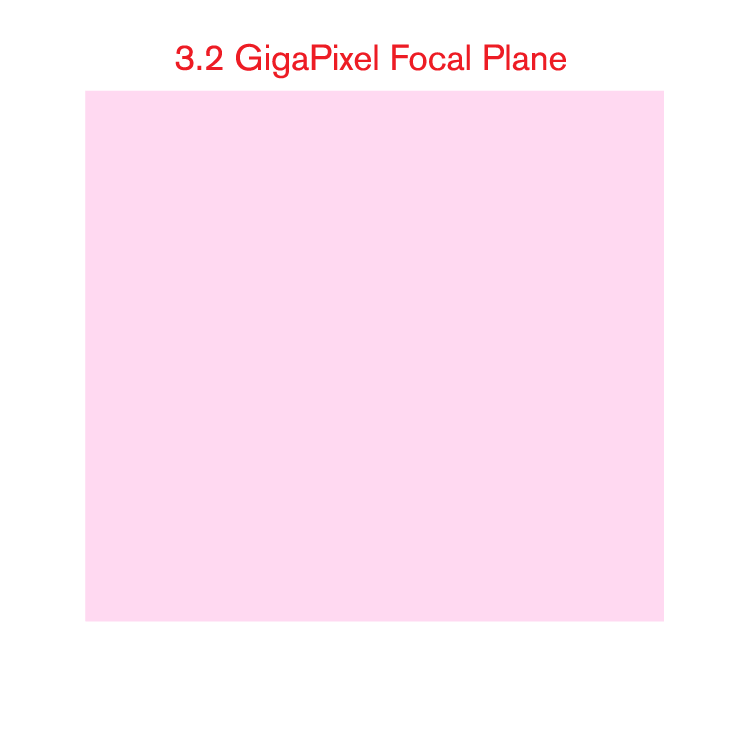

:css: css/talk.css

.. That's the light-background version.

.. Commenting out :css: css/talk_dark.css

..  Swap that in if you want the dark-background version

:title: If The Data Will Not Come To The Astronomer...
:author: Adam Thornton

If The Data Will Not Come To The Astronomer...
##############################################

Adam Thornton
=============

LSST
====

athornton@lsst.org

----

Overview
########

LSST
====

Astronomical Analysis Methodologies
===================================

Science Platform and Interactive Notebook Environment
=====================================================

----

LSST Overview
#############

One more entertaining overview, one page of cool statistics, and a
thorough overview:

* `Andy Connolly's LSST TED Talk`_.

* `LSST Key Numbers`_.

* `LSST Overview Paper`_.

* The Large Synoptic Survey Telescope is funded by the National Science
  Foundation and the Department of Energy, as well as a host of other
  donors, public and private.

.. _Andy Connolly's LSST TED Talk: https://www.ted.com/talks/andrew_connolly_what_s_the_next_window_into_our_universe

.. _LSST Key Numbers: https://confluence.lsstcorp.org/display/LKB/LSST+Key+Numbers

.. _LSST Overview Paper: https://arxiv.org/pdf/0805.2366.pdf

----

LSST Science Goals
##################

* LSST will perform a ten-year survey of the Southern sky: whole sky
  every three nights at optical and infrared wavelengths.

* Primary goal: detection of faint transient objects:

  * Near-Earth Objects (NEOs)

  * Trans-Neptunian Objects (TNOs)

  * Type Ia Supernovae (SN1ae)

----

What Can LSST See?
##################

Single-visit detection to 24.7 magnitude, 10-year-stacked to 27.5 (red
band).  That's very faint.  How faint?

Depth
=====

Every 5 magnitudes is a factor of 100 in brightness
---------------------------------------------------

Astronomy, being a science that existed before the Scientific
Revolution, has a truly astonishing amount of tech debt in its
nomenclature.

Magnitude as a concept dates back to Hipparchus, about 129 BCE.
Numerical magnitude dates to Ptolemy (c. 140 CE).  The fifth root of 100 as a precise quantification dates to 1856 and Norman
R. Pogson.

----

What Can LSST See?
##################

Depth
=====

Your eyes: 6 magnitude.  Mmmmmaybe 8 under ideal conditions.  Ptolemy's
faintest stars are "of the sixth magnitude."

A good amateur scope: 14ish magnitude (eyes), around 20 with CCDs

LSST depth
----------
* Saturates at 16 magnitude
* Single-visit (red) 24.7 magnitude
* 10-year stacked depth (red) 27.5 magnitude

Not the deepest
---------------

* Hubble Space Telescope: 31.
* James Webb Space Telescope: 34 magnitude (expected)

----

Field of view
#############

Depth isn't everything

* Humongous: 9.62 degrees^2
* 40 full moons; roughly a CD held at arm's length.
* JWST, by contrast, is 9.7 arcmin^2, so roughly 1/3600 of LSST.

----

Camera
======

* Focal plane array: 3.2 Gpixels
* 189 4K x 4K sensors
* 18 bits per pixel
* Each exposure 15 seconds
* Two exposures per visit (to do cosmic-ray/atmospheric transient
  rejection).

----

`LSST Mirror Design`_
=====================

* 8.4m, but that combines primary and tertiary
    * Effective collection area equivalent to 5.6m mirror
* Not the largest primary telescope mirror, but...
* The primary/tertiary mirror is the largest monolithic piece of glass
  ever fabricated

.. _LSST Mirror Design: https://www.lsst.org/about/tel-site/mirror

.. image:: images/mirror.gif
  :height: 600px

----

Data Collection
###############

* On the order of 20 TB a night (100x SDSS)
* Half an exabyte in the final image collection by operational EOL (DR11)
* Largest non-proprietary data set, period.
* Over one trillion photometric measures of celestial sources

----

Observations of Celestial Objects
#################################
* 10-40 million AGNs (quasars)
* 300,000 supernovae a year

  * Current detection rate is about 7,000 supernovae per year.  That's a
    fortyfold increase from current detection capabilities, from a
    single instrument.
    
  * A supernova explodes in a Milky-Way-scale galaxy one every few
    hundred years.
    
  * One goes off somewhere in the observable universe roughly every ten
    seconds.
    
* Roughly 20 billion galaxies
* Roughly 20 billion stars

----

Astronomical Research Status Quo
================================

Typically, astronomical research has been done with:

* Desktop or laptop computer
    * Usually pretty beefy by the standards of the day
* Astronomical software
    * Usually written by the researcher to address a particular
      hypothesis.
    * Usually written by a single astronomer, rather than a
      team of software engineers.
    * Maybe written by many astronomers, which is arguably worse.
* Downloaded data stored locally

----

Obvious Failure Modes
#####################

Usual Things About Personal Machines
====================================

* A pretty beefy computer from ten years ago is today's worthless
  paperweight
* Laptops get stolen a lot
* Individuals often are not careful about backing up data

----

Obvious Failure Modes
#####################

Analysis Software
=================

* If individually-written, usually reinvents many wheels, and only
  answers one question.

* General-purpose in-house analysis stacks are often extremely complex
  and difficult to install.

    * LSST stack's heritage, and a fair bit of the implementation, goes
      back to SDSS (began collecting data in 2000; obviously the
      software had been in development long before then).
    * An installation of the LSST stack from scratch takes hours for
      experienced users.
    * Taking weeks to install the first time is not unusual (also
      consuming experienced users' time).
    * I myself have never successfully managed a source install from
      scratch.

----

Obvious Failure Modes
#####################

Scale of the Data
=================

* Are you really going to download half an exabyte?
    * The input is 40 Gbps all night each night for 10 years.  How long
      is it going to take you to slurp it back out of the data center?
* "Big Data is data you cannot pick up."
    * Is half an exabyte still going to be Big Data in 2032?
    * I wouldn't bet *against* it.
  
----

Data Access
###########

Traditionally, you jealously guard your data so that you can publish
first and not get scooped.

* This works for small collaborations.
* LSST has thousands of researchers with data rights.
* And anyway there's so much data that access to the analysis is going
  to be much more valuable than access to the data.
  
    * Not *quite* true, hence the complicated data rights schemes we
      have...
    * Which turn out to be very broad.  Like, everyone affiliated with a
      US or Chilean institution, plus anyone affiliated with a member
      institution...
    * So maybe 10,000 out of 20,000 professional astronomers or advanced
      students...
    * Any of whom can invite someone to collaborate with them on a
      paper...
    * So except for the two people who don't have any friends...
        * And they're theorists anyway.

----

Data Scale
##########

* Almost all of this data will never be directly examined by a human.
* Most of the images do not contain anything very novel.
* We still expect to find, on average, one detector-saturating SN1a *per
  night*.  A million well-characterized SN1e over the survey life.
* Being stingy with the data is pretty self-defeating.
* An interesting parallel to how particle physics evolved into a Big
  Data/Big Collaboration/Big Science field can be found in `Giant
  Telescopes`_.

.. _Giant Telescopes: http://www.hup.harvard.edu/catalog.php?isbn=9780674019966

----

A Different Way To Do Astronomy
###############################

* Making your own private copy of the data set has become infeasible.
* The analysis, not the data, is the professionally-valuable part.
* How do we facilitate rapid iteration of analysis?
    * Quickly try a lot of hypotheses and discard the unpromising ones.
    * Once you have one you like, turn it loose on a lot of data.

----

Interactive vs. Batch
#####################

We expect that a researcher will use the "interactive notebook aspect of
the LSST Science Platform" (by which we mean JupyterLab, or perhaps its
successors) to perform this iteration.  Effectively, we make the
interactive environment a rapid prototyping tool.  It has the following
characteristics:

* Relatively tiny subset of the data: a few terabytes, probably less.
* The *real* analysis will be submitted to a batch system to work on
  petabyte-scale data.

What does this imply?

* It's not really about speed of data access or computation.
* Access to completely arbitrary subsets of the data, however, is
  *absolutely crucial*.

----

Community Acceptance
####################

The trickiest design goal is that we cannot make any researcher's life
significantly worse.

Obviously the current system isn't ideal:
* Large, complex, bespoke analysis stack.
* Hugely complicated installation and configuration.
* Enormous amounts of technical debt.

But...it also gets the job done.

We have to please a bunch of stakeholders.

----

Community of Stakeholders
#########################

Developers of the Analysis Pipeline
===================================

The LSST stack is big.  No one works on the whole thing.  The way it's
developed is that someone takes a version (either a release version,
approximately every 6 months, or a weekly build) and works on their own
little corner of it in a conda or pip environment.  We must support
that.

People Concerned With Data Rights
=================================

We *do* have to care who gets to see what, since the current belief in
the astronomical community is that big discoveries will be made quickly.
Since access is institutional or national, it's not quite as horrible as
it could be.

----

Community of Stakeholders
#########################

Education and Public Outreach
=============================

Here's where Data Rights gets particularly thorny.  You need to have
adequate data available to put together meaningful educational curricula
and enable citizen science, but not so much, or of such fidelity, that
someone without data rights can scoop a researcher with data rights.

It is not entirely clear to me that this is possible.

Established Astronomers
=======================

Kids these days with their fancy-pants Jupyter notebooks and their HDF5
data representations, but dangit FORTRAN IV and FITS were good enough
for my grandpappy an' they're good enough for me!  GET OFFA MY LAWN!

In practice: you need a Terminal window that gives you shell access to
something that looks like a Unix system.  We mimic a system on which you
have an unprivileged account, which is very familiar to academic users.

----

Community of Stakeholders
#########################

Security (and more generally Operations)
========================================

We understand how to create virtual machines and set them up as
multi-user systems.  But you want an ephemeral container?  That has
write access to certain filesystems?  That isn't going to be around long
enough to go through our Qualys scan and patching procedure?  That needs
to be available so quickly we can't even set it up with Puppet?  Are you
insane?

If we make it look like an existing multi-user system, with write access
to home directories and scratch space, but not the OS, and we show that
we can completely characterize what is in the container, this is a much
easier sell.

----

A Better World
##############

Let's imagine:

* You don't need to spend hours-to-weeks setting up the software
  environment.
* You have a single login to manage your access to the environment.
* All you need is a web browser.  Compute and data storage happen
  somewhere else.
* You don't need to pick a data subset that will fit on your laptop or
  your desktop NAS.
* Logs and metrics are collected, centralized, and presented on an ops
  dashboard.
* Standardized, modular infrastructure, allowing piece-by-piece
  component replacement of your application stack.
* And supportive of a publication paradigm that enables reproducability
  of results.

----

The Big Reveal
##############

(Not actually a surprise to anyone at this conference.)

JupyterHub + JupyterLab + Kubernetes
====================================
* JupyterLab: the UX is much better than the classic notebook.
  Multiple panes within a single broswer tab, including terminal
  sessions, is a tremendous feature, giving users basically an IDE.
* JupyterHub: the obvious choice for access control and resource
  allocation brokering.  Authenticator and Spawner subclasses let us
  do some really nifty things, which you will see.
* Kubernetes: it clearly won.  Google, Amazon, and Azure all offer
  managed Kubernetes infrastructure.

----

Abstraction and Layering
########################

* Virtualization lets you not care about the specifics of your hardware.
* Containerization lets you not care about managing the OS/distribution
  layer.
* Kubernetes gives you a standardized way to talk about container
  orchestration without having to care how your containers talk to each
  other or how that network talks to the outside world.

----

The Long Bet
############

Kubernetes will save astronomy.

* It's the first time we've had a functional abstraction layer that
  allows you to specify architectural designs.

    * Get rid of: "you need Solaris 10 on SPARC, and Sybase (not Postgres!)
      and Websphere MQ, and..."
    * Instead: "We need a kubernetes cluster with a predefined
      nginx-ingress-controller and three service accounts: default
      access is fine for the first, the second needs to be able to
      create, destroy, describe, and list pods, and the third has to do
      that plus do cluster-wide read operations."
* Then you can create complex multicomponent applications that will run
  on any suitable cluster.

----

Modularity
##########

* Delineate plumbing from application.
* Provide a clear way to replace the value-added part (for us: the LSST
  Science Pipeline) with your own payload.
* Retain the robust infrastructure with component lifecycle management
  and automated resource allocation.

I would be flabbergasted if this approach were not portable to other
physical sciences and very possibly to other (and very general) analytic
problem spaces. 

----

LSST JupyterLab Implementation
##############################

Overview
========

`SQR-018`_ describes the architecture.

The complete implementation is available at `GitHub`_.

.. image:: images/jupyterlab_sp.png
  :height: 600px

.. _SQR-018: https://sqr-018.lsst.io/

.. _GitHub: https://github.com/lsst-sqre/jupyterlabdemo

----

Deployment
##########

We have an automated tool for GKE plus DNS at Route53 to deploy.

* Makes it very easy to stand up a new cluster for tutorials or
  meetings.
  
* Can also generate configuration YAML from templates plus environment
  variables, or from a supplied configuration file.  The YAML can
  then be hand-tweaked for, e.g., on-premises deployment at our
  Long-Term Storage Facility.

----

Problem 1: Authentication
#########################

Authentication is annoying and hard.  Let's outsource it.

* OAuth2 is a thing, and JupyterHub supports it well.

* Our current setup lets us use either GitHub or CILogon with the NCSA
  ID provider (adding other providers and sources is straightforward).

* You do need a public endpoint with a verifiable TLS certificate to do
  the OAuth callback.

* However, this is still way too open

----

Problem 2: Authorization
########################

How do we restrict beyond "has a GitHub/NCSA account"?

Both have concepts of group memberships.

* OAuth2 scopes allow us to attach capabilities to tokens; for instance,
  "enumerate a user's groups."  That's what you need to determine if you
  are in the LSST group.

* Subclass the `OAuth2 authenticator`_ in ``jupyterhub_config.py``.  

.. _OAuth2 authenticator: https://github.com/lsst-sqre/jupyterlabdemo/blob/master/jupyterhub/sample_configs/github/10-authenticator.py

----

Problem 3: Global User Consistency
##################################

GitHub's user account ID fits into a 32-bit value.  Each GitHub
Organization also has an ID.  There are our UID/GID maps.

CILogon does something similar.

Now you have globally consistent users and groups.

----

Problem 4: Restricting User Access
##################################

We control the environment in the newly-created Lab container.

We use that to provision a user with the right UID+GIDs set.

Then we become that user before starting the JupyterLab server.

----

Problem 5: Persistent Storage
#############################

We have globally unique UIDs and GIDs.

* We mount ``/home`` and whatever other filesystems we want.

* Data access and sharing immediately collapses to the long-solved
  problem of Unix filesystem access.

* We use NFS, because it's easy.

    * We provision the space and volumes in the cloud.
    * We point to an external NFS server at our LDF.
    
* We could eventually be cleverer, but we're still going to make it look
  like a POSIX filesystem to our users.

----

Problem 6: User Access Restriction
##################################

Don't give your users ``sudo``.

Globally-consistent UID and GIDs.

You're done.

Users can still override bits of the stack with ``pip install --user``.

----

Problem 7: Auditability and Maintainability
###########################################

It's a container.  You know how you built it (at least if you use
particular package versions, not ``latest``).  It's repeatable and
immutable.

We look for regressions in the stack by creating an `options form`_ that
scans our repository and presents a menu of recent builds.

.. _options form: https://github.com/lsst-sqre/jupyterlabdemo/blob/master/jupyterhub/sample_configs/github/20-spawner.py

----

Problem 8: Startup Time and User Frustration
############################################

Our images are huge and take on the order of 15 minutes to pull.

So we pre-pull them.

Within, say, an hour and a half of building (which is usually in the
middle of the night) each image is available on each node and therefore
starts quickly.

----

Resources
#########

* `Zero To JupyterHub`_.
* `JupyterLab (and Hub) Gitter`_.
* `LSST JupyterLab Implementation`_.

.. _Zero to JupyterHub: https://github.com/jupyterhub/zero-to-jupyterhub-k8s/

.. _JupyterLab (and Hub) Gitter: https://gitter.im/jupyterlab/jupyterlab

.. _LSST JupyterLab Implementation: https://github.com/lsst-sqre/jupyterlabdemo

----

Live Demo
#########

----

Questions
#########
